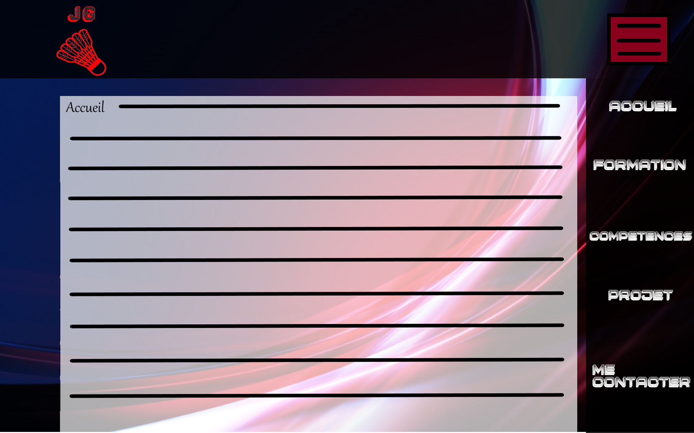

**CCI-SIO21-Portfolio**

**Charte :**

 

**Le fond :**

**

 

 

**Mon logo :**

 

(Le "Logo 2" ne contient pas de fond.)

**Police et couleur**

Les liens en haut de page et le nom de la page en bas à droite toujours en **police** : « Monochrome », et en couleur : blanc #FFFFFF

Le texte au milieu de page sur chaque page en **police** : « Gabriola », et en couleur= noir #000000

Les pages seront disposées de cette manière :

 

